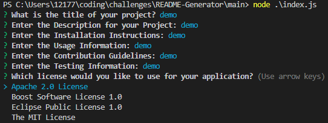

# README-Generator
This is an app that quickly and easily creates a high quality README.md by just filling in prompts.

## Table of Contents
- [Installation](#Installation)
- [Usage](#Usage)
- [Contributing](#Contributing)
- [Questions](#Questions)
- [Acknowldgements](#Acknowledgements)

## Installation
In order to run this program you will need a code editor, either VS code or something similar. Once opening the main file open the terminal and input 'node index.js' This will start the app.

## Usage 
Once the app starts user will be given a series of prompts to fill out that correlate to sections of the README to be created. User will be asked to fill out the description, installation, usage, contribution guidlines and testing requirements. Next the user will be asked to pick license information and be given four options to choose from. The up/down arrow keys will allow user move through the options. Finally the user will be asked for email and Github Username which will be shown in the questions section with instructions on how to contact the README creator with questions or issues. 

## Contributing 
In order to contribute to this work, fork the reposiutoty and submit pull requests for my approval.

## Questions
Please refer any questions or problem issues to bhoff1980@gmail.com.

## Acknowledgments
Andres Jimenez (Tudor)  
Kirtley Adams (Teaching Assistant)  
Dan Kaltenbaugh (Instructor) 
George Yoo (Teaching Assisstant)

